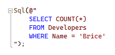

# SQL Embedded Language Prototype

This is a prototype for adding syntax highlighting to SQL inside of C# strings. It leverages internal extensibility points of Roslyn by forking [parts of Roslyn](https://github.com/dotnet/roslyn/tree/44555193fd1135b5d53a2099f76fec91e0d1ebde/src/Tools/ExternalAccess/AspNetCore) and [parts of ASP.NET Core](https://github.com/dotnet/aspnetcore/tree/v8.0.0-rc.1.23421.29/src/Framework/AspNetCoreAnalyzers/src/Analyzers)--their route pattern syntax highlighting. It uses the [SQL ScriptDOM](https://github.com/microsoft/SqlScriptDOM) library for parsing SQL.

## Testing

To test the highlighting in Visual Studio, build the solution then run `install.cmd` as an administrator. Then create an ASP.NET Core project targeting .NET 8.0. After that, it should work on APIs annotated with `[StringSyntax("Sql")]`.

## Warning: Brittle

This code is very brittle and was created for a hackathon. It is hard-coded to VS 17.8 Preview 2 and .NET 8.0 RC 1.